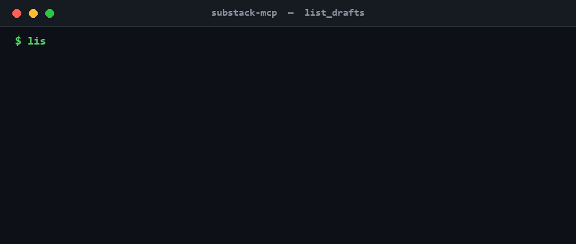

<div align="center">

# substack-mcp

An MCP server for Substack. Read your publication data and manage drafts from your AI agent. Long-form posts are draft-only by design — no publish, no delete. Short-form Notes publish immediately.

[](LICENSE)
[](https://www.typescriptlang.org/)
[](https://www.npmjs.com/package/@conorbronsdon/substack-mcp)
[](https://modelcontextprotocol.io/)
[](https://chainofthought.show)
[](https://x.com/ConorBronsdon)

</div>

---



An MCP server for Substack that lets AI assistants read your publication data and manage drafts. The draft list shown in the demo above is sample data, not real account values.

**Safe by design — with one loud exception:** This server cannot publish or delete long-form posts. Post tools create and edit drafts only; you review and publish manually through Substack's editor. The exception is Substack **Notes**: `create_note` and `create_note_with_link` publish short-form Notes immediately, because Notes have no draft state on Substack. Treat the Note tools as public-publish actions — there is no preview step and no undo from this server.

<a href="https://glama.ai/mcp/servers/conorbronsdon/substack-mcp">
  
</a>

## About

Built and maintained by [Conor Bronsdon](https://github.com/conorbronsdon) for the [Chain of Thought](https://chainofthought.show) podcast production workflow, where it drafts and reviews newsletter posts before a human hits publish. Conor hosts Chain of Thought, a show about AI infrastructure and how practitioners actually build with it. More tools for creators live in [ai-tools-for-creators](https://github.com/conorbronsdon/ai-tools-for-creators). Find Conor on X at [@ConorBronsdon](https://x.com/ConorBronsdon).

**Sibling MCP servers:**
- [Transistor-MCP](https://github.com/conorbronsdon/Transistor-MCP): manage podcast episodes, analytics, and transcripts on Transistor.fm
- [podcastindex-mcp](https://github.com/conorbronsdon/podcastindex-mcp): search the Podcast Index and track guest appearances

## Tools

Every tool declares MCP [tool annotations](https://modelcontextprotocol.io/docs/concepts/tools#tool-annotations), set **explicitly** rather than left to MCP's defaults (an omitted `destructiveHint` or `openWorldHint` defaults to `true`). Reads carry `readOnlyHint: true`. Every write is additive, so all writes carry `destructiveHint: false`. Draft writes are private (`openWorldHint: false`); `upload_image` carries `openWorldHint: true` because it returns a publicly-fetchable CDN URL; and the Note tools carry `openWorldHint: true` for immediate public publish. Annotations are untrusted hints, so the authoritative wording lives in each tool's description.

### Read

| Tool | Description |
|------|-------------|
| `get_subscriber_count` | Get your publication's current subscriber count |
| `list_published_posts` | List published posts with pagination |
| `list_drafts` | List draft posts |
| `get_post` | Get full content of a published post by ID |
| `get_draft` | Get full content of a draft by ID |
| `get_post_comments` | Get comments on a published post |

### Write (private drafts; image upload returns a public URL)

| Tool | Description |
|------|-------------|
| `create_draft` | Create a new draft from markdown (private) |
| `update_draft` | Update an existing draft (unpublished only; private) |
| `upload_image` | Upload an image to Substack's CDN — returns a publicly-fetchable (unlisted) URL |

### Publish (Notes — public immediately)

| Tool | Description |
|------|-------------|
| `create_note` | Publish a Substack Note (short-form, **publishes immediately**) |
| `create_note_with_link` | Publish a Note with a link card attachment (**publishes immediately**) |

Notes have no draft state on Substack, so there is no draft-first option for these two tools.

### Intentionally excluded

- **Publish posts** — Publishing long-form posts should be a deliberate human action (Notes are the documented exception above)
- **Delete** — Too destructive for an AI tool
- **Schedule** — Use Substack's editor for scheduling

## Setup

### 1. Get your credentials

Open your Substack in a browser, then:

1. **Session token:** Navigate to your publication, open DevTools → Application → Cookies → copy the value of `connect.sid` (URL-encoded string starting with `s%3A`)
2. **User ID:** In DevTools Console, run: `fetch('/api/v1/archive?sort=new&limit=1').then(r=>r.json()).then(d=>console.log(d[0]?.publishedBylines?.[0]?.id))`
3. **Publication URL:** Your Substack URL, including custom domain if you have one (e.g., `https://newsletter.yourdomain.com` or `https://yourblog.substack.com`)

### 2. Configure your MCP client

#### Claude Desktop

Add to your `claude_desktop_config.json`:

```json
{
  "mcpServers": {
    "substack": {
      "command": "npx",
      "args": ["-y", "@conorbronsdon/substack-mcp"],
      "env": {
        "SUBSTACK_PUBLICATION_URL": "https://yourblog.substack.com",
        "SUBSTACK_SESSION_TOKEN": "your-session-token",
        "SUBSTACK_USER_ID": "your-user-id"
      }
    }
  }
}
```

#### Claude Code

Add to your `.mcp.json`:

```json
{
  "mcpServers": {
    "substack": {
      "command": "npx",
      "args": ["-y", "@conorbronsdon/substack-mcp"],
      "env": {
        "SUBSTACK_PUBLICATION_URL": "https://yourblog.substack.com",
        "SUBSTACK_SESSION_TOKEN": "your-session-token",
        "SUBSTACK_USER_ID": "your-user-id"
      }
    }
  }
}
```

### 3. Verify

Ask your AI assistant: "How many Substack subscribers do I have?"

## Token expiration

Substack session tokens expire periodically (typically ~90 days). If you get authentication errors, grab a fresh `connect.sid` cookie from your browser and update the env var. Make sure ad blockers are disabled when copying the cookie.

## Markdown support

The `create_draft` and `update_draft` tools accept markdown and convert it to Substack's native format. Supported:

- Paragraphs, headings (h1–h6)
- **Bold**, *italic*, `inline code`
- [Links](https://example.com)
- Images
- Bullet and numbered lists
- Code blocks (with language)
- Blockquotes
- Horizontal rules

## Important notes

- This server uses Substack's **unofficial API**. It may break if Substack changes their endpoints.
- Session tokens are sent as cookies. Keep your `SUBSTACK_SESSION_TOKEN` secure.
- The server validates authentication on startup and will fail fast if your token is expired.

## Development

```bash
git clone https://github.com/conorbronsdon/substack-mcp.git
cd substack-mcp
npm install
npm run build
```

Run locally:
```bash
SUBSTACK_PUBLICATION_URL=https://yourblog.substack.com \
SUBSTACK_SESSION_TOKEN=your-token \
SUBSTACK_USER_ID=your-id \
npm start
```

## Contributing

Issues and pull requests are welcome. Because this server uses Substack's unofficial API, the most useful contributions are fixes when an endpoint changes. If a tool stops working, open an issue with the tool name and the error. The safe-by-design boundary stays: no publish, no delete, no schedule for long-form posts. Notes publish immediately by design and must keep saying so loudly in their descriptions.

---

## Disclaimer

*All views, opinions, and statements expressed on this account are solely my own and are made in my personal capacity. They do not reflect, and should not be construed as reflecting, the views, positions, or policies of Modular. This account is not affiliated with, authorized by, or endorsed by Modular in any way.*

## License

MIT
