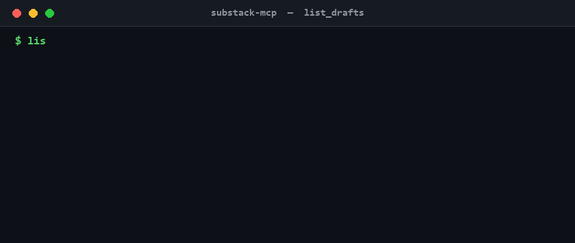

<div align="center">

# substack-mcp

An MCP server for Substack. Read your publication data and manage drafts from your AI agent. Long-form posts are draft-only by design — no publish, no delete. Short-form Notes publish immediately.

[](LICENSE)
[](https://www.typescriptlang.org/)
[](https://www.npmjs.com/package/@conorbronsdon/substack-mcp)
[](https://modelcontextprotocol.io/)
[](https://chainofthought.show/?utm_source=github&utm_medium=referral&utm_campaign=repo-readme&utm_content=substack-mcp)
[](https://x.com/ConorBronsdon)

</div>

---



An MCP server for Substack that lets AI assistants read your publication data and manage drafts. The draft list shown in the demo above is sample data, not real account values.

**Safe by design — with one loud exception:** This server cannot publish or delete long-form posts. Post tools create and edit drafts only; you review and publish manually through Substack's editor. The exception is Substack **Notes**: `create_note` and `create_note_with_link` publish short-form Notes immediately, because Notes have no draft state on Substack. Treat the Note tools as public-publish actions — there is no preview step and no undo from this server. The split is proportionate review, the piece of trust infrastructure for agents this server cares most about: the high-stakes surface gets a human gate, and the exception is stated loudly.

<a href="https://glama.ai/mcp/servers/conorbronsdon/substack-mcp">
  
</a>

## Tools

Every tool declares MCP [tool annotations](https://modelcontextprotocol.io/docs/concepts/tools#tool-annotations), set **explicitly** rather than left to MCP's defaults (an omitted `destructiveHint` or `openWorldHint` defaults to `true`). Reads carry `readOnlyHint: true`. Every write is additive, so all writes carry `destructiveHint: false`. Draft writes are private (`openWorldHint: false`); `upload_image` carries `openWorldHint: true` because it returns a publicly-fetchable CDN URL; and the Note tools carry `openWorldHint: true` for immediate public publish. Annotations are untrusted hints, so the authoritative wording lives in each tool's description.

### Read

| Tool | Description |
|------|-------------|
| `get_subscriber_count` | Get your publication's current subscriber count |
| `list_published_posts` | List published posts with pagination |
| `list_drafts` | List draft posts |
| `get_post` | Get full content of a published post by ID |
| `get_draft` | Get full content of a draft by ID |
| `get_post_comments` | Get comments on a published post |
| `get_sections` | List your publication's sections (categories) with their IDs |
| `get_post_analytics` | Get a published post's stats (views, opens, signups, subscribes, reactions) by ID |
| `list_scheduled_posts` | List posts scheduled for future publication (read-only; scheduling stays in Substack's editor) |

### Write (private drafts; image upload returns a public URL)

| Tool | Description |
|------|-------------|
| `create_draft` | Create a new draft from markdown (private) |
| `update_draft` | Update an existing draft (unpublished only; private) |
| `upload_image` | Upload an image to Substack's CDN — returns a publicly-fetchable (unlisted) URL |

### Publish (Notes — public immediately)

| Tool | Description |
|------|-------------|
| `create_note` | Publish a Substack Note (short-form, **publishes immediately**) |
| `create_note_with_link` | Publish a Note with a link card attachment (**publishes immediately**) |

Notes have no draft state on Substack, so there is no draft-first option for these two tools.

### Intentionally excluded

- **Publish posts** — Publishing long-form posts should be a deliberate human action (Notes are the documented exception above)
- **Delete** — Too destructive for an AI tool
- **Schedule** — Use Substack's editor for scheduling. (`list_scheduled_posts` *reads* what you've queued there, but this server never creates, edits, or cancels a schedule.)

## Setup

You can supply credentials two ways: paste them as env vars (below), or run the
optional **browser login** which captures and stores them for you.

### Option A — Browser login (optional, no manual cookie copying)

Removes the DevTools cookie hunt and the ~90-day re-copy. Playwright is **not**
bundled (it's large), so install it once, then sign in:

```bash
npm i -g playwright && npx playwright install chromium
npx --package @conorbronsdon/substack-mcp substack-mcp-login https://yourblog.substack.com
```

A browser opens; sign in to Substack (CAPTCHA included). The tool captures your
session cookie, auto-resolves your user id, and writes them to
`~/.substack-mcp/session.json` (override the directory with `SUBSTACK_MCP_HOME`).
The MCP server reads that file automatically whenever the `SUBSTACK_*` env vars
are unset — so with browser login you can omit the `env` block entirely.

**Storage & security:** the file is written `0600` and encrypted with AES-256-GCM
under a key derived from this OS account + machine (never stored). A copied file
is useless elsewhere and casual disk/backup reads see only ciphertext. This is
machine-binding + obfuscation, **not** a secret vault — code running as you on
this machine can re-derive the key (the same caveat as the plaintext env-var
path). If you prefer, use Option B and let your MCP client handle the secret.

### Option B — Get your credentials manually

Open your Substack in a browser, then:

1. **Session token:** Navigate to your publication, open DevTools → Application → Cookies → copy the value of `connect.sid` (URL-encoded string starting with `s%3A`)
2. **User ID:** In DevTools Console, run: `fetch('/api/v1/archive?sort=new&limit=1').then(r=>r.json()).then(d=>console.log(d[0]?.publishedBylines?.[0]?.id))`
3. **Publication URL:** Your Substack URL, including custom domain if you have one (e.g., `https://newsletter.yourdomain.com` or `https://yourblog.substack.com`)

### 2. Configure your MCP client

#### Claude Desktop

Add to your `claude_desktop_config.json`:

```json
{
  "mcpServers": {
    "substack": {
      "command": "npx",
      "args": ["-y", "@conorbronsdon/substack-mcp"],
      "env": {
        "SUBSTACK_PUBLICATION_URL": "https://yourblog.substack.com",
        "SUBSTACK_SESSION_TOKEN": "your-session-token",
        "SUBSTACK_USER_ID": "your-user-id"
      }
    }
  }
}
```

#### Claude Code

Add to your `.mcp.json`:

```json
{
  "mcpServers": {
    "substack": {
      "command": "npx",
      "args": ["-y", "@conorbronsdon/substack-mcp"],
      "env": {
        "SUBSTACK_PUBLICATION_URL": "https://yourblog.substack.com",
        "SUBSTACK_SESSION_TOKEN": "your-session-token",
        "SUBSTACK_USER_ID": "your-user-id"
      }
    }
  }
}
```

### 3. Verify

Ask your AI assistant: "How many Substack subscribers do I have?"

## Multiple publications

Running more than one publication behind a single server? Set a `SUBSTACK_PUB_<KEY>_*` triplet per publication instead of the plain `SUBSTACK_*` vars. `<KEY>` is any name you choose (letters, digits, underscores) — it becomes the publication's lowercase, hyphenated key, e.g. `KEVIN_MULDOON` → `kevin-muldoon`.

```json
"env": {
  "SUBSTACK_PUB_KEVIN_MULDOON_PUBLICATION_URL": "https://kevinmuldoon.substack.com",
  "SUBSTACK_PUB_KEVIN_MULDOON_SESSION_TOKEN": "token-1",
  "SUBSTACK_PUB_KEVIN_MULDOON_USER_ID": "111",
  "SUBSTACK_PUB_SAPERE_PUBLICATION_URL": "https://sapere.substack.com",
  "SUBSTACK_PUB_SAPERE_SESSION_TOKEN": "token-2",
  "SUBSTACK_PUB_SAPERE_USER_ID": "222"
}
```

Each triplet is independent, and setting *any* `SUBSTACK_PUB_<KEY>_*` variable declares that publication. An incomplete triplet — a missing variable, an empty value, or a whitespace-only value — fails startup with an error naming the key, rather than silently dropping that publication. That matters because a dropped publication is not "one fewer publication": drop the only one and the server falls back to your stored browser-login session; drop one of two and every tool loses its `publication` parameter, so a call meant for the dropped publication routes silently to the surviving one.

Keys are compared case-insensitively, with `_` folded to `-`. Two names that resolve to the same key (`SUBSTACK_PUB_ALPHA_*` and `SUBSTACK_PUB_Alpha_*`) are a startup error too — merging them silently would let one publication's URL pair with another's session token.

`<KEY>` accepts ASCII letters, digits, and underscores; the three suffixes must be uppercase and the whole name must have no stray whitespace. Anything that begins with `SUBSTACK_PUB_` but does not fit that shape — a hyphen in the key, a lowercase suffix, an accented character, a trailing space — is a startup error naming the variable, not a variable that gets quietly ignored. For the same reason as above: an ignored publication is not one fewer publication, it is a silent reroute to a different one.

With two or more publications configured, every tool gains a **required** `publication` parameter — one of your configured keys (e.g. `kevin-muldoon`, `sapere` above). The calling model must specify one on every call; an unrecognized value is rejected before any Substack API call is made, so a stray write can't land on the wrong publication. **With exactly one publication configured** — the common case, whether via plain `SUBSTACK_*` vars or a single `SUBSTACK_PUB_<KEY>_*` triplet — **no `publication` parameter is added at all**; every tool's schema is unchanged from single-publication mode.

Don't mix the two styles: if any `SUBSTACK_PUB_<KEY>_*` var is set, the plain `SUBSTACK_*` vars are ignored (with a startup warning) rather than treated as an unnamed extra publication.

`SUBSTACK_USER_AGENT` and `SUBSTACK_REQUEST_TIMEOUT_MS` apply to every configured publication — they are not per-publication. The browser-login flow (`substack-mcp-login`) is single-publication only; multiple publications require the env-var scheme above.

## Token expiration

Substack session tokens expire periodically (typically ~90 days). If you get authentication errors, grab a fresh `connect.sid` cookie from your browser and update the env var (make sure ad blockers are disabled when copying the cookie) — or, if you used the browser login, just re-run `substack-mcp-login` to refresh the stored session.

## Custom domains & Cloudflare

Substack publications served on a custom domain (e.g. `blog.example.com`) sit behind Cloudflare, which can reject non-browser requests with `403 error code: 1010`. To avoid this, the server sends a browser `User-Agent` and a `Referer` by default, and addresses the publication by its canonical `*.substack.com` host.

- **Use the canonical host.** Set `SUBSTACK_PUBLICATION_URL` to the publication's `*.substack.com` address rather than the custom domain. Calls to the canonical host are served directly; custom-domain calls may 301-redirect and then 401.
- **Override the User-Agent** (optional) via `SUBSTACK_USER_AGENT` if you need a different browser signature:

```json
"env": {
  "SUBSTACK_PUBLICATION_URL": "https://yourblog.substack.com",
  "SUBSTACK_SESSION_TOKEN": "your-session-token",
  "SUBSTACK_USER_ID": "your-user-id",
  "SUBSTACK_USER_AGENT": "Mozilla/5.0 ..."
}
```

## Request timeout

Every request to Substack is bounded by a 30-second deadline. Node applies no request timeout of its own — only a 10-second *connect* timeout — so a host that accepts the connection and then goes silent (a proxy that drops packets rather than refusing them) would otherwise hang a tool call indefinitely. A request that hits the deadline fails with a `TimeoutError` naming the endpoint and the limit.

Raise or lower it with `SUBSTACK_REQUEST_TIMEOUT_MS` (milliseconds; a non-numeric or non-positive value is ignored with a warning and the default is used):

```json
"env": {
  "SUBSTACK_REQUEST_TIMEOUT_MS": "60000"
}
```

## Typed errors

API failures are mapped to a typed error hierarchy (`SubstackAPIError` base, with `AuthenticationError`, `RateLimitError`, `ValidationError`, `NotFoundError`, and `ServerError` subclasses keyed off HTTP status) in `src/utils/errors.ts`. Every tool call still surfaces the same error response shape on failure — the typed hierarchy just makes the message specific to what went wrong instead of a single generic "Substack API error" string.

| Class | Status | Triggered by |
|---|---|---|
| `AuthenticationError` | 401/403 | Expired/invalid session token, or a Cloudflare `error code: 1010` block (see above) |
| `RateLimitError` | 429 | Too many requests against the Substack API in a short window |
| `ValidationError` | 400 | Malformed or invalid arguments passed to a tool (e.g. a missing required field) |
| `NotFoundError` | 404 | The referenced draft, post, or note doesn't exist |
| `ServerError` | 5xx | Failure on Substack's side |
| `TimeoutError` | 408 (synthetic) | The request hit the client's own deadline — no response arrived, so there is no real status to report (see [Request timeout](#request-timeout)) |
| `SubstackAPIError` | any other status | Fallback for unmapped status codes |

Substack error response bodies are inconsistent — sometimes JSON (`{"error": "..."}` or `{"errors": [...]}`), sometimes plain text, and sometimes a large Cloudflare HTML block page. `extractErrorDetail` handles all three: it tries `JSON.parse` first, falls back to the raw text (trimmed and capped at ~500 characters so a multi-KB HTML page doesn't become the whole error message), and only uses a generic fallback string if the body is empty.

## Markdown support

The `create_draft` and `update_draft` tools accept markdown and convert it to Substack's native format. Supported:

- Paragraphs, headings (h1–h6)
- **Bold**, *italic*, `inline code`
- [Links](https://example.com)
- Images
- Bullet and numbered lists, including **nested lists** (arbitrary depth, mixed ordered/unordered)
- Code blocks (with language)
- Blockquotes
- Horizontal rules

**Tables:** Substack's post editor has no table node, so a markdown table cannot be rendered natively. Rather than mangle the pipes into a paragraph, a detected GFM table is preserved verbatim inside a code block — the content survives so you can reformat it (as an image or embed) in Substack's editor.

## Important notes

- This server uses Substack's **unofficial API**. It may break if Substack changes their endpoints.
- Session tokens are sent as cookies. Keep your `SUBSTACK_SESSION_TOKEN` secure.
- The server checks your credentials on startup, *after* the MCP handshake completes, and only warns — it never blocks startup on a network call. Tools still error individually if the token is expired, which is where the failure is actionable.
- `SIGTERM` and `SIGINT` are handled: the server closes its transport and exits 0, so `docker stop` returns promptly instead of waiting out the grace period.

## Development

```bash
git clone https://github.com/conorbronsdon/substack-mcp.git
cd substack-mcp
npm install
npm run build
```

Run locally:
```bash
SUBSTACK_PUBLICATION_URL=https://yourblog.substack.com \
SUBSTACK_SESSION_TOKEN=your-token \
SUBSTACK_USER_ID=your-id \
npm start
```

## Contributing

Issues and pull requests are welcome. Because this server uses Substack's unofficial API, the most useful contributions are fixes when an endpoint changes. If a tool stops working, open an issue with the tool name and the error. The safe-by-design boundary stays: no publish, no delete, no schedule for long-form posts. Notes publish immediately by design and must keep saying so loudly in their descriptions.

## About

Built and maintained by [Conor Bronsdon](https://github.com/conorbronsdon) for the [Chain of Thought](https://chainofthought.show/?utm_source=github&utm_medium=referral&utm_campaign=repo-readme&utm_content=substack-mcp) podcast production workflow, where it drafts and reviews newsletter posts before a human hits publish. Conor hosts Chain of Thought, a show about AI infrastructure and how practitioners actually build with it. More tools for creators live in [ai-tools-for-creators](https://github.com/conorbronsdon/ai-tools-for-creators). Find Conor on X at [@ConorBronsdon](https://x.com/ConorBronsdon).

**Companion tools:**
- [Transistor-MCP](https://github.com/conorbronsdon/Transistor-MCP): manage podcast episodes, analytics, and transcripts on Transistor.fm
- [podcastindex-mcp](https://github.com/conorbronsdon/podcastindex-mcp): search the Podcast Index and track guest appearances
- [op3-mcp](https://github.com/conorbronsdon/op3-mcp): report downloads, listener geography, and apps from OP3
- [apple-podcasts-mcp](https://github.com/conorbronsdon/apple-podcasts-mcp): pull plays, followers, and per-episode listening from Apple Podcasts Connect
- [gsc-mcp](https://github.com/conorbronsdon/gsc-mcp): query search performance, keywords, and sitemaps in Google Search Console
- [podcast-benchmark](https://github.com/conorbronsdon/podcast-benchmark): benchmark a show against its peers using only public data

---

## Disclaimer

*This is an independent personal project, not affiliated with, sponsored by, or endorsed by any company. All views expressed are my own.*

## License

MIT
